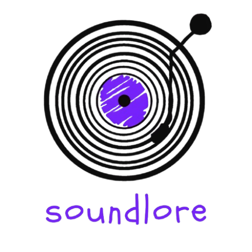

<div align="center">
  
  <p>Uma plataforma web de música construída com Laravel, Inertia.js e React/TypeScript.</p>

  **Descubra a história por trás da música.**

  Uma plataforma web para explorar artistas, músicas e gêneros — com curiosidades, capas e vídeos integrados automaticamente via APIs externas.

  [](https://laravel.com)
  [](https://react.dev)
  [](https://inertiajs.com)
  [](https://tailwindcss.com)
  [](https://filamentphp.com)
  [](LICENSE)
</div>

---

## 📖 Sobre o projeto

**SoundLore** é uma plataforma de catálogo musical construída com **Laravel** no backend e **React + TypeScript** no frontend, unidos pelo **Inertia.js** (sem precisar de uma API REST separada). O projeto reúne artistas, músicas e gêneros em um só lugar, enriquecendo cada página automaticamente com capas de álbum e fotos de artista via **Deezer** e vídeos via **YouTube**, além de um painel administrativo completo construído com **Filament**.

## ✨ Funcionalidades

- 🎧 Catálogo de músicas organizado por gênero (`/generos/{genero}`)
- 📄 Página de detalhes de cada música (`/musicas/{id}`), com curiosidades e comentários
- 👤 Perfil de artista com discografia (`/artistas/{id}`)
- 🖼️ Busca automática de capas de álbum e fotos de artista via **API pública do Deezer**
- ▶️ Reprodução/integração com **YouTube** para os vídeos das músicas
- 💬 Comentários de usuários autenticados nas músicas
- 🛠️ Painel administrativo em `/admin` (Filament) para gerenciar Artistas, Músicas, Gêneros, Curiosidades e Comentários
- 🔷 Interface tipada em **TypeScript** com React via Inertia.js
- 🎨 Estilização com Tailwind CSS v4 (fontes: Bodoni Moda, Inter, Space Mono)

## 🧱 Stack

| Camada | Tecnologia |
|---|---|
| Backend | Laravel 13 (PHP 8.4) |
| Frontend | React + TypeScript (via Inertia.js) |
| Estilos | Tailwind CSS v4 (`@tailwindcss/vite`) |
| Admin | Filament |
| Banco de dados | MySQL 8.4 |
| Ambiente | Docker via Laravel Sail |
| APIs externas | Deezer (capas/fotos), YouTube Data API (vídeos) |
| Build | Vite |

## 📋 Pré-requisitos

- [Docker](https://www.docker.com/) e Docker Compose
- PHP 8.4+ (opcional na máquina host, o Sail já traz)
- Composer
- Node.js 20+ e npm

## 🚀 Montando o ambiente de desenvolvimento

```bash
# 1. Clone o repositório
git clone https://github.com/Mayza414/soundlore.git
cd soundlore

# 2. Copie o arquivo de ambiente
cp .env.example .env

# 3. Instale as dependências PHP (via Composer + Docker, sem precisar de PHP local)
docker run --rm \
    -u "$(id -u):$(id -g)" \
    -v "$(pwd):/var/www/html" \
    -w /var/www/html \
    laravelsail/php84-composer:latest \
    composer install --ignore-platform-reqs

# 4. Suba os containers (app + MySQL)
./vendor/bin/sail up -d

# 5. Gere a chave da aplicação
./vendor/bin/sail artisan key:generate

# 6. Rode as migrations com os dados de exemplo (seeds)
./vendor/bin/sail artisan migrate --seed

# 7. Instale as dependências do frontend
./vendor/bin/sail npm install

# 8. Suba o servidor de desenvolvimento do Vite
./vendor/bin/sail npm run dev
